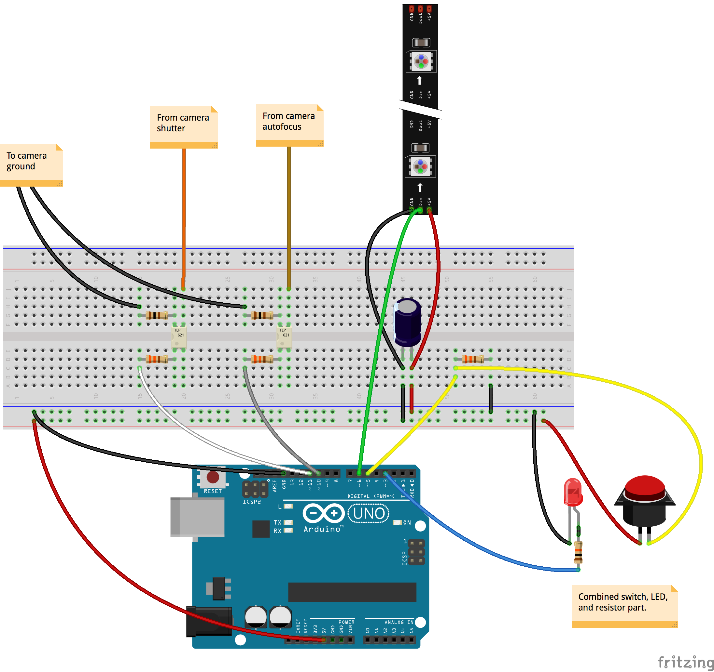

# Arduino Photo Booth

This is the source for a photo booth driven by an Arduino-based intervalometer connected to a Canon EOS 350D camera.

Here's a simplified illustration:

# Dependencies

This project assumes the following hardware components:

Pin | Component
--- | ---------
3   | LED
5   | [Arcade button microswitch](http://www.adafruit.com/products/1188), normally open
6   | Two chained [Adafruit NeoPixel Sticks](http://www.adafruit.com/products/1426)
10  | A single-channel [optoisolator](https://www.sparkfun.com/products/314) (autofocus)
11  | A single-channel optoisolator (shutter)

Digital pin 13 is also used for controlling the built-in surface mount LED on the Arduino Uno. The LED is used for debugging purposes, and is not required for normal operation.

The sketch requires the following libraries:

* [Adafruit NeoPixel Arduino library](https://learn.adafruit.com/adafruit-neopixel-uberguide/arduino-library)
* [Andy Brown's Arduino easing library](http://andybrown.me.uk/wk/2010/12/05/animation-on-the-arduino-with-easing-functions/)

# Usage

Upload the sketch to your Arduino Uno or compatible micro controller (see [the official Arduino IDE documentation](http://arduino.cc/en/Guide/HomePage) for detailed instructions).

# License

This project is MIT licensed. See the included `LICENSE` file for details.
