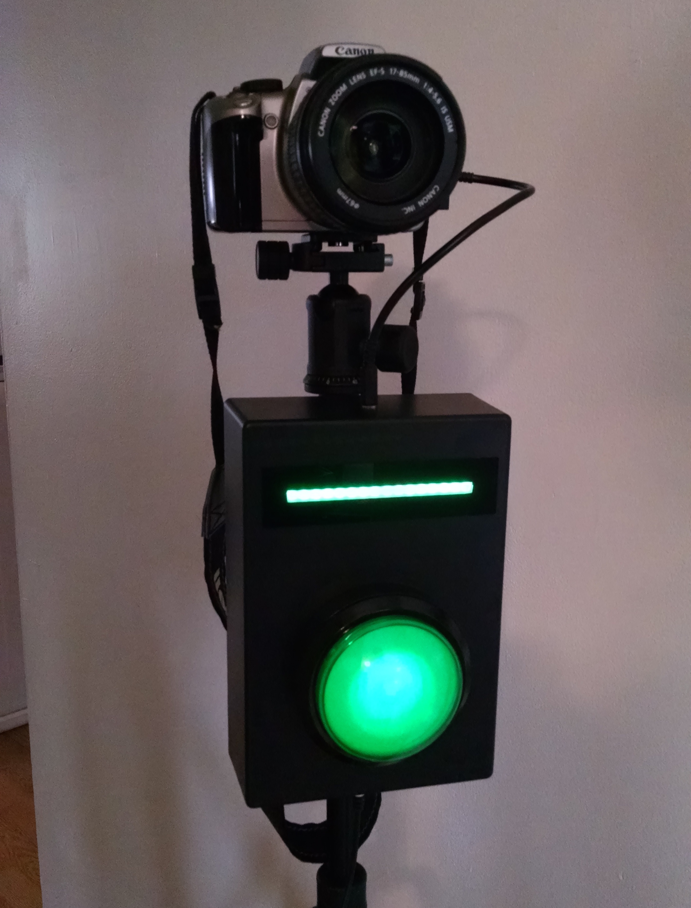
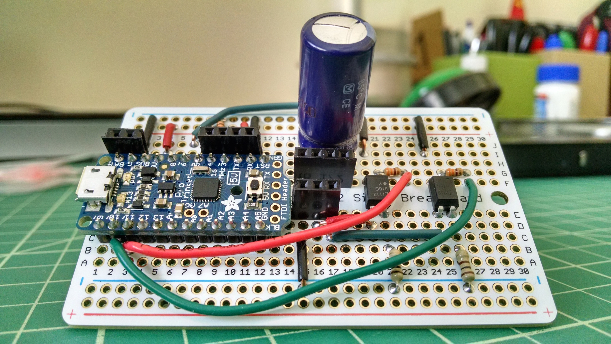

# Arduino Photo Booth

This repository contains the source for a photo booth driven by an Arduino-based intervalometer connected to a Canon EOS 350D camera. I put together this project for my friends' wedding reception in March 2015, in lieu of them renting a hugely expensive photo booth from a vendor. Instead of using a photo printer, I used [an eyefi Wi-Fi SD card](http://www.eyefi.com/) to automatically upload photos to flickr, so photo booth users could see their work on their smartphones soon after taking a photo. The reception attendees had a great time with it: [see for yourself](https://www.flickr.com/photos/52758581@N00/sets/72157651154513687/)!

Here's an illustration of the circuit:

And here's the circuit as assembled on a prototyping board:

# Dependencies

This project assumes the following hardware components:

Pin | Component
--- | ---------
3   | LED
4   | [Arcade button microswitch](http://www.adafruit.com/products/1188), normally open
6   | Two chained [Adafruit NeoPixel Sticks](http://www.adafruit.com/products/1426)
10  | A single-channel [optoisolator](https://www.sparkfun.com/products/314) (autofocus)
11  | A single-channel optoisolator (shutter)

Digital pin 13 is also used for controlling the built-in surface mount LED on the Arduino Uno. The LED is used for debugging purposes, and is not required for normal operation.

The sketch requires the following libraries:

* [Adafruit NeoPixel Arduino library](https://learn.adafruit.com/adafruit-neopixel-uberguide/arduino-library)
* [Andy Brown's Arduino easing library](http://andybrown.me.uk/wk/2010/12/05/animation-on-the-arduino-with-easing-functions/)

# Usage

Upload the sketch to your Arduino Uno or compatible micro controller (see [the official Arduino IDE documentation](http://arduino.cc/en/Guide/HomePage) for detailed instructions).

# License

This project is MIT licensed. See the included `LICENSE` file for details.
